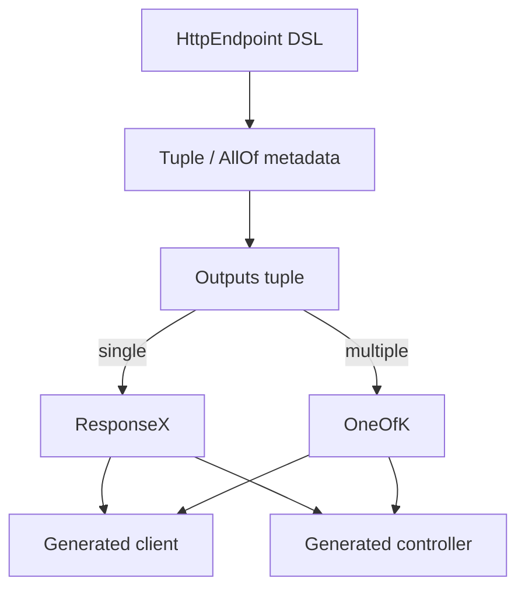

# Type Safety in Tapik

Tapik’s primary goal is to keep HTTP contracts type-safe from declaration to runtime. The DSL models every piece of an endpoint—parameters, headers, bodies, and response branches—with immutable, strongly-typed structures. Generators rely on these structures to emit Kotlin that cannot drift from the original definition.

## Building Blocks

| Concept | Interface | Purpose | Common Aliases |
| --- | --- | --- | --- |
| Heterogeneous tuple (product) | `AllOf` | Represents *all* items that must exist together | `Parameters`, `Headers`, `Outputs`, `HeaderValues`, `Responses` |
| Discriminated union (sum) | `OneOf` | Represents *one* branch chosen at runtime | `OneOf2`, `OneOf3`, … up to `OneOf10` |

### AllOf and Tuple Aliases

`AllOf` is a family of interfaces (`AllOf0` … `AllOf10`) with `itemN` accessors. Concrete Tapik types reuse these through the `Tuple` façade so you do not manipulate `AllOf` directly.

```kotlin
typealias Headers3<H1, H2, H3> =
    Tuple3<Header<*>, Header<H1>, Header<H2>, Header<H3>>
```

Because `Headers3` implements `AllOf4`, the compiler knows:

- `headers.item1` is the first `Header<*>`.
- `headers.item2` is `Header<H1>`, preserving the codec type.
- Iteration is still possible via the `Listable` interface.

Tapik ships aliases for each arity so you can declare headers, parameters, and responses without manual tuple plumbing:

| Alias | Description |
| --- | --- |
| `Parameters0` … `Parameters10` | Path/query parameter definitions |
| `Headers0` … `Headers10` | Request header definitions |
| `HeaderValues0` … `HeaderValues10` | Decoded inbound header values |
| `Outputs0` … `Outputs10` | Ordered list of `(StatusMatcher, Headers, Body)` combinations |
| `Response0` / `ResponseWithoutBody0` families | Runtime responses returned by generated code |

### OneOf and Conditional Responses

`OneOf` models exclusive branches. Each arity exposes inline `OptionN` value classes and a `select` helper for exhaustive handling.

```kotlin
fun interpret(result: OneOf3<Response0<User>, ResponseWithoutBody0, ResponseWithoutBody0>) =
    result.select(
        when1 = { response -> "Found user ${response.body.id}" },
        when2 = { "User missing" },
        when3 = { "User deleted" }
    )
```

Generators lean on these unions in two places:

- **Client code** returns `OneOfK` when an endpoint declares multiple outputs, forcing call sites to handle every status path.
- **Server code** expects implementers to return the matching `OptionN` when emitting a non-default response, ensuring real runtime branches align with the DSL.

### AllOf + OneOf Together

`Outputs` is an `AllOf` tuple of `Output` definitions. At runtime, responses are wrapped in either a concrete `ResponseX` (single output) or a `OneOfK<ResponseX, …>` (multiple outputs). This combination gives Tapik strong guarantees:

1. The number and order of outputs in the DSL matches the generated code and Markdown documentation.
2. Header codecs are preserved all the way to runtime decoding (`decodeHeadersN`).
3. Exhaustive `select` calls mean adding a new output is a compile-time change for every consumer.



## Tips for Working with These Types

1. **Prefer aliases**: use `Headers3` instead of wiring `Tuple3` manually. The aliases pick correct variance and marker interfaces.
2. **Let the DSL infer tuples**: `input(header.uuid("X-Request-Id"))` returns `Input<Headers1<UUID>, EmptyBody>` automatically—no explicit types required.
3. **Use `select` in clients**: exhaustively pattern match `OneOf` results to enforce business logic for every status.
4. **Return the right union option**: when implementing generated controllers, wrap alternate responses in `OneOfK.OptionN` to keep Tapik aware of which branch fired.
5. **Leverage codecs**: bodies and headers carry codecs, so even custom `AllOf` combinations continue to encode/decode data safely.

Understanding `AllOf` and `OneOf` is the key to appreciating Tapik: the DSL describes APIs once, and the type system guarantees that every generated artifact agrees with the definition. Take a look at the runtime helpers (`EncodeHeadersMethods.kt`, `DecodeHeadersMethods.kt`, `Responses.kt`) if you want to explore further.
